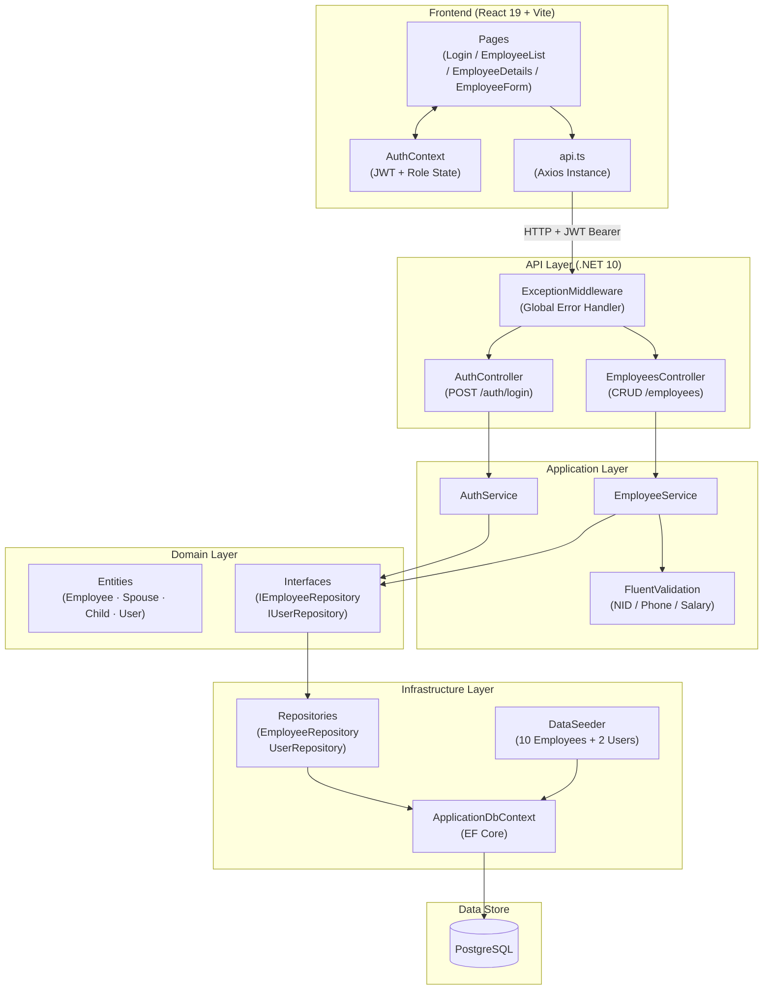

# Employee & Family Registry System


A production-quality full-stack application for managing employee and family details efficiently.

## Features

- **Decoupled Architecture**: .NET 10 Web API backend + React 19 (TypeScript/Vite) frontend.
- **Relational Database**: PostgreSQL supported via Entity Framework Core.
- **Authentication**: JWT authentication with BCrypt password hashing.
- **Role-Based Access Control**: `Admin` (Full CRUD) vs `Viewer` (Read-only).
- **Advanced Validation**: FluentValidation for correct Bangladeshi NID formats (10 or 17 digits) and Phone formats.
- **Optimized Searching**: 400ms debounced queries against Name, NID, and Department using backend case-insensitive matching.
- **Reporting**: Export the current Employee List view to PDF, or export a detailed CV of a specific employee (including spouse and children's dates of births).
- **Responsive UI**: Tailwind CSS styled components.

---

## Architecture Diagram



---

## Project Structure

```
employee-family-registry-system/
├── docker-compose.yml
├── README.md
├── docs/
│   ├── SRS.md
│   └── DeploymentGuide.md
│
├── backend/
│   ├── EmployeeRegistry.sln
│   ├── Dockerfile
│   │
│   ├── EmployeeRegistry.Api/              # Entry point — Controllers & Middleware
│   │   ├── Program.cs
│   │   ├── appsettings.json
│   │   ├── Controllers/
│   │   │   ├── AuthController.cs
│   │   │   └── EmployeesController.cs
│   │   └── Middleware/
│   │       └── ExceptionMiddleware.cs
│   │
│   ├── EmployeeRegistry.Application/      # Business logic — Services, DTOs, Validation
│   │   ├── DependencyInjection.cs
│   │   ├── Services/
│   │   │   ├── AuthService.cs
│   │   │   └── EmployeeService.cs
│   │   ├── DTOs/
│   │   │   ├── AuthDtos.cs
│   │   │   ├── EmployeeDtos.cs
│   │   │   ├── SpouseDtos.cs
│   │   │   └── ChildDtos.cs
│   │   └── Validators/
│   │       └── EmployeeValidators.cs
│   │
│   ├── EmployeeRegistry.Domain/           # Core entities & repository interfaces
│   │   ├── Entities/
│   │   │   ├── Employee.cs
│   │   │   ├── Spouse.cs
│   │   │   ├── Child.cs
│   │   │   └── User.cs
│   │   └── Interfaces/
│   │       ├── IEmployeeRepository.cs
│   │       └── IUserRepository.cs
│   │
│   ├── EmployeeRegistry.Infrastructure/   # EF Core, Migrations, Seeding
│   │   ├── DependencyInjection.cs
│   │   ├── Data/
│   │   │   ├── ApplicationDbContext.cs
│   │   │   └── DataSeeder.cs
│   │   ├── Repositories/
│   │   │   ├── EmployeeRepository.cs
│   │   │   └── UserRepository.cs
│   │   └── Migrations/
│   │
│   ├── EmployeeRegistry.UnitTests/
│   └── EmployeeRegistry.IntegrationTests/
│
└── frontend/
    └── employee-registry-ui/              # React 19 + Vite + Tailwind CSS
        ├── index.html
        ├── vite.config.ts
        ├── tailwind.config.js
        ├── Dockerfile
        └── src/
            ├── App.tsx
            ├── main.tsx
            ├── index.css
            ├── pages/
            │   ├── Login.tsx
            │   ├── EmployeeList.tsx
            │   ├── EmployeeDetails.tsx
            │   └── EmployeeForm.tsx
            ├── components/
            │   ├── layout/Layout.tsx
            │   └── ui/
            │       ├── Button.tsx
            │       └── Input.tsx
            ├── context/
            │   └── AuthContext.tsx
            ├── services/
            │   └── api.ts
            └── types/
```

---

## Getting Started

### Prerequisites
- [.NET 10 SDK](https://dotnet.microsoft.com/en-us/download/dotnet/10.0)
- [Node.js (LTS Version)](https://nodejs.org/)
- [PostgreSQL Server](https://www.postgresql.org/)

### Backend Setup
1. Open the project folder in terminal.
2. Update the `ConnectionStrings:DefaultConnection` correctly in `backend/EmployeeRegistry.Api/appsettings.json` with your real PostgreSQL credentials.
3. **Run Migrations**: The application can auto-seed on startup, but you can explicitly apply migrations to your PostgreSQL database using EF Core tools:
   ```bash
   dotnet ef database update --project backend/EmployeeRegistry.Infrastructure --startup-project backend/EmployeeRegistry.Api
   ```
   ```bash
   dotnet build backend/EmployeeRegistry.sln
   dotnet run --project backend/EmployeeRegistry.Api
   ```
4. The Swagger API definitions will be available locally (usually `https://localhost:7196/swagger`).
5. **Database Seeding**: The app boots up and seeds 10 realistic employees. It also creates two default users:
   - Admin Login: `admin` / `Admin@123`
   - Viewer Login: `viewer` / `Viewer@123`

### Frontend Setup
1. Open a new terminal instance and navigate to the frontend folder:
   ```bash
   cd frontend/employee-registry-ui
   ```
2. Install dependencies (Legacy peer deps used ensuring Tailwind v3 / PostCSS plugin compatibility with React 19 packages):
   ```bash
   npm install --legacy-peer-deps
   ```
3. Run the development server:
   ```bash
   npm run dev
   ```
### Docker Setup (Easiest)
You can build and run the entire application stack in a single command using Docker Compose:
1. Ensure Docker Desktop is installed and running.
2. Open a terminal in the root project folder containing `docker-compose.yml`.
3. Run the following command:
   ```bash
   docker-compose up --build
   ```
4. Access the applications:
   - **Frontend UI**: `http://localhost:3000`
   - **Backend API**: `http://localhost:8081/api` (Swagger at `http://localhost:8081/swagger`)
   - **PostgreSQL**: `localhost:5432`

## 🌐 Live Deployment

- **Frontend (Vercel):** [https://employee-family-registry-system.vercel.app/](https://employee-family-registry-system.vercel.app/)
- **Backend (Render):** [https://employee-family-registry-system-1.onrender.com/](https://employee-family-registry-system-1.onrender.com/)
- **Database (Supabase):** PostgreSQL Managed Instance

Refer to [docs/DeploymentGuide.md](docs/DeploymentGuide.md) for step-by-step instructions.

---

## Architectural Notes
- The backend strictly enforces structural layers: **Domain** (Core rules/Entities) -> **Application** (DTOs, Validation, Interfaces, Business Logic) -> **Infrastructure** (Implementation of Repositories, DbContext) -> **Api** (Controllers, Middleware).
- **Global Error Handling**: Uncaught exceptions are globally handled natively by middleware to return a sanitized, consistent JSON response model across API ends avoiding leaky stacktraces.
- **React Frontend**: State mapping is driven contextually (`AuthContext`). We use `react-hook-form` connected to `yup` for high performance frontend validation bridging cleanly with the backend `FluentValidation` requirements.

Refer to [docs/SRS.md](docs/SRS.md) for the Entity-Relationship (ER) diagram and precise technical limitations.
