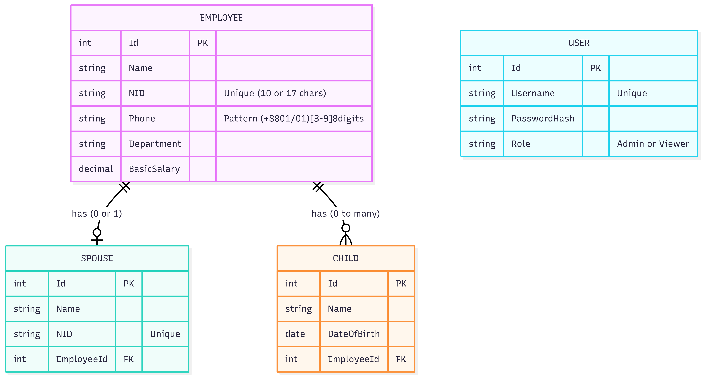

# Software Requirements Specification (SRS)

## 1. Introduction & System Scope
The **Employee & Family Registry System** is a business application designed to manage employee profiles along with their immediate family details (spouses and children). It facilitates CRUD operations, fast searches, secure access, and PDF data export features.

**Explicit Scope Exclusions (What this system does NOT do):**
- It does NOT handle payroll processing or tax calculations.
- It does NOT track employee attendance, timesheets, or leave management.
- It does NOT support multi-tenant organizational structures.

## 2. Entity Relationship (ER) Diagram

## 3. System Architecture
The software consists of two main decoupled components:
*   **Backend**: .NET 10 ASP.NET Core Web API following Clean Architecture (Domain, Application, Infrastructure, Api) and the Repository software pattern.
*   **Frontend**: React 19 SPA built with Vite and TypeScript, styled with Tailwind CSS v3.

### 3.1 Technologies
*   **Database**: PostgreSQL
*   **ORM**: Entity Framework Core 10
*   **Auth**: JSON Web Tokens (JWT) + BCrypt Password Hashing
*   **Frontend Data Fetching**: Axios

## 4. Roles and Permissions
1.  **Admin**
    *   Can login, view all employee data, search.
    *   Can **Create, Update, and Delete** employees.
    *   Can export PDF lists and CVs.
2.  **Viewer**
    *   Can login, view all employee data, search.
    *   Can export PDF lists and CVs.
    *   **Cannot** modify any data.

## 5. Key Features & Edge Cases Handled
1.  **NID Validation**: Bangladesh National IDs must be either exactly 10 digits or 17 digits. Validation handles this dynamically. Ensures uniqueness across all employees and spouses.
2.  **Phone Number Validation**: Strict Regex matching for valid Bangladeshi phone numbers natively implemented in FluentValidation.
3.  **Search with Debounce**: The frontend debounces user keystrokes for 400ms before hitting the backend search API, reducing database load tremendously and preventing "flickering" API calls.
4.  **Security**: Hashes passwords using BCrypt. Validates API endpoints via `[Authorize(Roles="Admin")]`.
5.  **Data Consistency**: Entity Framework enforces `Cascade Delete` behavior. Deleting an Employee automatically deletes their associated Spouse and Children from PostgreSQL to prevent orphaned records.
6.  **Export to PDF**: The system automatically generates neat, tabular PDFs. Individual CV generation outputs a structured, professional dossier containing family relationships.

## 6. API Overview

All API endpoints are prefixed with `/api`. Authentication endpoints are public; all employee endpoints require a valid JWT Bearer token.

| Method | Endpoint | Auth Required | Role | Description |
|--------|----------|--------------|------|-------------|
| `POST` | `/api/auth/login` | No | — | Authenticate and receive JWT token |
| `POST` | `/api/auth/register` | No | — | Register a new user account |
| `GET` | `/api/employees` | Yes | Any | List all employees (supports `?search=`) |
| `GET` | `/api/employees/{id}` | Yes | Any | Get a single employee by ID |
| `POST` | `/api/employees` | Yes | Admin | Create a new employee |
| `PUT` | `/api/employees/{id}` | Yes | Admin | Update an existing employee |
| `DELETE` | `/api/employees/{id}` | Yes | Admin | Delete an employee and family records |

**Request / Response format**: All endpoints consume and produce `application/json`. Validation errors return HTTP `400` with a structured `Errors` array. Unauthorised requests return `401`. Forbidden role access returns `403`.

---

## 7. Non-Functional Requirements

### 7.1 Performance
- Search queries must respond within **500ms** under normal load.
- Frontend debounces search input by **400ms** to minimise redundant API calls.
- EF Core retry-on-failure policy (5 retries, 10s back-off) ensures transient DB errors are recovered automatically.

### 7.2 Security
- All passwords are hashed using **BCrypt** before storage — plaintext passwords are never persisted.
- JWT tokens expire after **60 minutes**; the secret key is injected via environment variables and never committed to source control.
- Write endpoints (`POST`, `PUT`, `DELETE`) are protected by `[Authorize(Roles="Admin")]`.
- Global `ExceptionMiddleware` catches unhandled exceptions and returns a sanitised error response — raw stack traces are never exposed to clients.

### 7.3 Scalability
- The backend follows Clean Architecture, making it straightforward to swap the data store or add new application services without touching the API layer.
- Stateless JWT authentication allows horizontal scaling of backend instances behind a load balancer without shared session state.

### 7.4 Reliability
- EF Core migrations run automatically on startup, ensuring the schema is always up to date.
- The Docker Compose stack uses a `healthcheck` on the PostgreSQL container so the backend only starts after the database is confirmed ready.
- Cascade delete is enforced at the database level, preventing orphaned `Spouse` or `Child` rows if an employee is deleted.

### 7.5 Maintainability
- All layers are separated by project boundaries (`.Domain`, `.Application`, `.Infrastructure`, `.Api`) enforcing the dependency rule.
- FluentValidation rules are co-located in the `Application` layer, keeping controllers thin.
- Frontend validation mirrors backend rules using the same regex patterns, ensuring consistency without duplication of business logic.

---

## 8. Assumptions
Throughout the development of this system, the following logic and constraints were assumed:
1.  **Monogamy Constraint**: An employee can only have one spouse registered in the system at any given time (One-to-One relationship).
2.  **Global Identity Uniqueness**: The Bangladeshi NID must be unique continuously across the entire database. An employee and a spouse cannot share the same NID, nor can two spouses.
3.  **Salary Representation**: "Basic Salary" is assumed to be a fixed, non-negative decimal value representing monthly pay in BDT.
4.  **Date of Birth Boundaries**: Children must logically have a Date of Birth in the past. Future dates are blocked.
