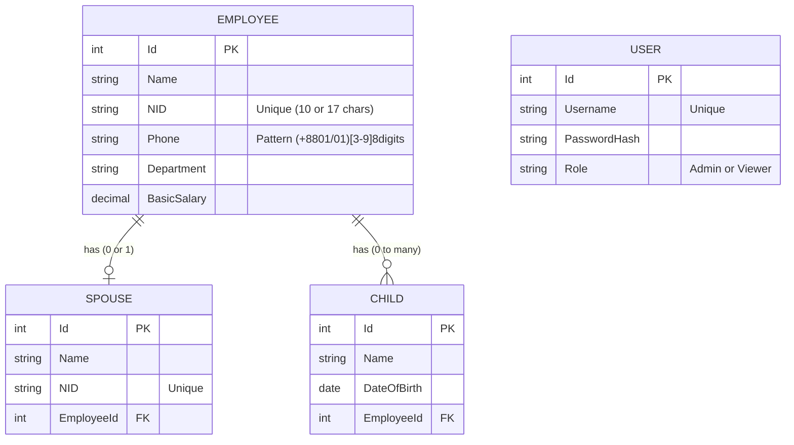

# Software Requirements Specification (SRS)

## 1. Introduction & System Scope
The **Employee & Family Registry System** is a business application designed to manage employee profiles along with their immediate family details (spouses and children). It facilitates CRUD operations, fast searches, secure access, and PDF data export features.

**Explicit Scope Exclusions (What this system does NOT do):**
- It does NOT handle payroll processing or tax calculations.
- It does NOT track employee attendance, timesheets, or leave management.
- It does NOT support multi-tenant organizational structures.

## 2. System Architecture
The software consists of two main decoupled components:
*   **Backend**: .NET 8 ASP.NET Core Web API following Clean Architecture (Domain, Application, Infrastructure, Api) and the Repository software pattern.
*   **Frontend**: React 19 SPA built with Vite and TypeScript, styled with Tailwind CSS v3.

### 2.1 Technologies
*   **Database**: PostgreSQL
*   **ORM**: Entity Framework Core 8
*   **Auth**: JSON Web Tokens (JWT) + BCrypt Password Hashing
*   **Frontend Data Fetching**: Axios

## 3. Entity Relationship (ER) Diagram

## 4. Roles and Permissions
1.  **Admin**
    *   Can login, view all employee data, search.
    *   Can **Create, Update, and Delete** employees.
    *   Can export PDF lists and CVs.
2.  **Viewer**
    *   Can login, view all employee data, search.
    *   Can export PDF lists and CVs.
    *   **Cannot** modify any data.

## 5. Key Features & Edge Cases Handled
1.  **NID Validation**: Bangladesh National IDs must be either exactly 10 digits or 17 digits. Validation handles this dynamically. Ensures uniqueness across all employees and spouses.
2.  **Phone Number Validation**: Strict Regex matching for valid Bangladeshi phone numbers natively implemented in FluentValidation.
3.  **Search with Debounce**: The frontend debounces user keystrokes for 400ms before hitting the backend search API, reducing database load tremendously and preventing "flickering" API calls.
4.  **Security**: Hashes passwords using BCrypt. Validates API endpoints via `[Authorize(Roles="Admin")]`.
5.  **Data Consistency**: Entity Framework enforces `Cascade Delete` behavior. Deleting an Employee automatically deletes their associated Spouse and Children from PostgreSQL to prevent orphaned records.
6.  **Export to PDF**: The system automatically generates neat, tabular PDFs. Individual CV generation outputs a structured, professional dossier containing family relationships.

## 6. Assumptions
Throughout the development of this system, the following logic and constraints were assumed:
1.  **Monogamy Constraint**: An employee can only have one spouse registered in the system at any given time (One-to-One relationship).
2.  **Global Identity Uniqueness**: The Bangladeshi NID must be unique continuously across the entire database. An employee and a spouse cannot share the same NID, nor can two spouses.
3.  **Salary Representation**: "Basic Salary" is assumed to be a fixed, non-negative decimal value representing monthly pay in BDT.
4.  **Date of Birth Boundaries**: Children must logically have a Date of Birth in the past. Future dates are blocked.
